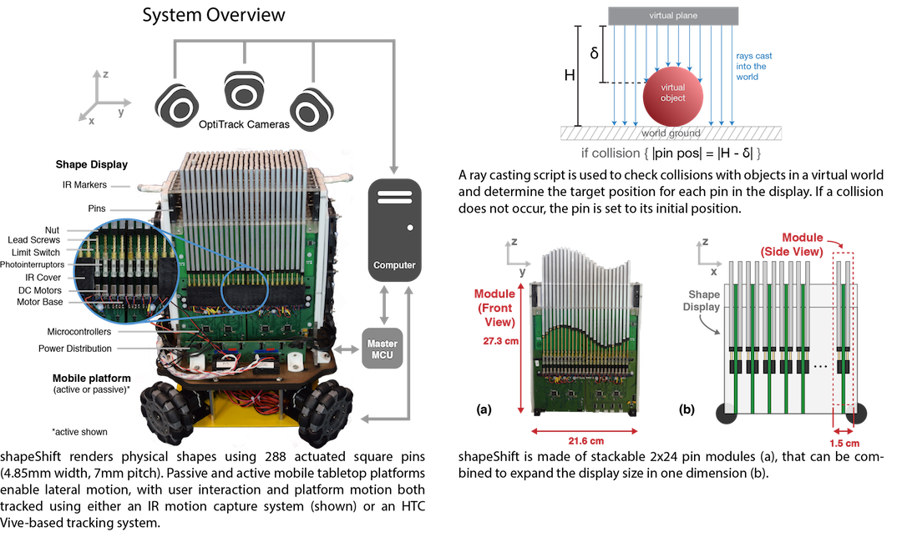

## shapeShift: 2D Spatial Manipulation and Self-Actuation of Tabletop Shape Displays for Tangible and Haptic Interaction 

shapeShift is a compact, high-resolution (7 mm pitch), mobile tabletop shape display. We explore potential interaction techniques in both passive and active mobile scenarios. In the passive case, the user is able to freely move and spin the display as it renders elements. We introduce use cases for rendering lateral I/O elements, exploring volumetric datasets, and grasping and manipulating objects. On an active omnidirectional-robot platform, shapeShift can display moving objects and provide both vertical and lateral kinesthetic feedback. We use the active platform as an encounter-type haptic device combined with a head-mounted display to dynamically simulate the presence of virtual content. Future work will continue to explore the diverse dynamic interactions afforded by high-fidelity mobile shape-changing interfaces. 

Read more at the [shape lab website](http://shape.stanford.edu/research/shapeShift/)

### Technical Implementation

	

### Getting started
CAD, PCB, firmware and software files are provided. Detailed instructions and link to BOM can be found in [these slides](https://docs.google.com/presentation/d/1R9Z0mCOPYOkJPzbJNwtG9fEYhSLC97248hX_nJxPLbI/edit?usp=sharing).

### Latest Updates
- Released PCB + CAD files
- Firmware + software coming soon

### Authors
[Alexa F. Siu](http://alexasiu.com), Eric J. Gonzalez, Shenli Yuan, Jason B. Ginsberg, and Sean Follmer

 

	 This work is licensed under a <a rel="license" href="http://creativecommons.org/licenses/by-sa/4.0/">Creative Commons Attribution-ShareAlike 4.0 International License</a>.

